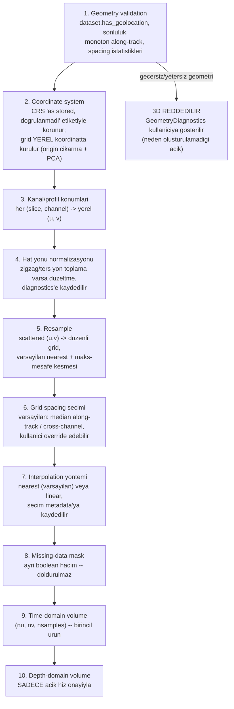

# 3D Volume Data Model (tasarım — henüz implemente edilmedi)

> **Durum:** Tasarım belgesi. `src/archaeogpr/gridding/` henüz yoktur.
> Bu not, gelecekteki Sprint 3D-1/3D-2'nin üzerine inşa edeceği veri
> modelini ve aşama ayrımını tanımlar — bkz.
> [[02_SPRINTS/Sprint_GUI_0_Foundation]].

## Amaç

Tek bir `.ogpr` swath'ının `(slice, channel, sample)` verisinden,
**gerçek survey geometrisinden türetilen** bir quasi-3D zaman-domeni
(ve, açık bir hız onayıyla, derinlik-domeni) hacim üretmenin aşamalarını
ve veri modelini tanımlamak. GPRPy'nin `makeDataCube` fonksiyonundan
(bkz. [[09_REFERENCES/GPRPy_Reference_and_License_Notes]]) yalnızca
"nearest-neighbor + maliyet gerekçeli varsayılan" fikri alınmıştır; kod
alınmamıştır ve GPRPy'nin maskesiz (boşlukları en yakın değerle dolduran)
yaklaşımı **kasıtlı olarak** benimsenmemiştir — bu tasarım her zaman
açık bir `missing_mask` taşır.

**İlk 3D hedefi** (kullanıcı onayı): `Swath003_Array02.ogpr`'ın kendi
slice×channel geometrisinden oluşan quasi-3D hacim. Çok-swath birleştirme
sonraki sprintlere bırakıldı.

## Aşamalar (her biri ayrı, test edilebilir bir fonksiyon olacak)

## `GeometryDiagnostics` (aşama 1 çıktısı)

Mevcut `compute_trace_spacing()`
(`src/archaeogpr/processing/background.py`) zaten geolocation → metadata
`sampling_step_m` → `unavailable` önceliğini uyguluyor ve trace-spacing'i
hiçbir zaman sabit gömmüyor (bkz. ADR-008) — gridding bu fonksiyonu
**yeniden kullanacak**, kopyalamayacak. `GeometryDiagnostics` bunun
üzerine şunları ekler: `has_geolocation`, `finite_coordinate_fraction`,
`along_track_monotonic_per_channel`, `spacing_cv_per_channel`,
`direction_reversals_detected`, ve nihai `can_build_volume: bool` +
`rejection_reason: str | None`. **Uydurma hacim asla üretilmez** —
`can_build_volume=False` ise GUI kullanıcıya bu diagnostics'i (neden
reddedildiğini) gösterir, boş/varsayılan bir hacim göstermez.

## Grid ve Bellek

Örnek veri (`Swath003_Array02.ogpr`) için mevcut geometri:
along-track spacing (median) ≈ 0.0403 m, cross-channel spacing (median)
≈ 0.0750 m, profil ≈ 6.97 m, swath genişliği ≈ 0.75 m, 1024 örnek/iz
(float32) — bkz. [[04_DATASETS/Swath003_Array02]]. Varsayılan grid
spacing'iyle (du≈0.040 m, dv≈0.075 m) tahmini hacim boyutu
`nu≈175 × nv≈11 × 1024 × 4 byte` ≈ 7.9 MB — mevcut ham veriyle aynı
mertebede. Cross-track'i örn. 1 cm'e sıklaştırmak (`nv≈75`) hacmi
≈54 MB'a çıkarır — hâlâ rahat. **Bellek tahmini, hacim oluşturulmadan
önce GUI'de gösterilecek** (kullanıcı gereksinimi H) ve eşik üstünde
downsampling/grid kabalaştırma seçenekleri sunulacak.

## Zaman-Derinlik Dönüşümü

Depth-domain hacim (aşama 10), yalnızca kullanıcı bir propagation
velocity onayladığında üretilir — metadata'daki
`radar.propagation_velocity_m_per_ns` (`Swath003_Array02.ogpr` için
0.1 m/ns) **öneri olarak gösterilir**, sessizce uygulanmaz (bkz.
[[01_PROJECT_STATE/04_Risks_and_Limitations]] madde 2,
[[05_PROCESSING/Velocity_Analysis]]). Kullanılan hız, formül
(`depth = v·t/2`), birimler ve varsayımlar hacmin kendi metadata'sına
JSON olarak yazılır — CLAUDE.md'nin "Depth conversion requires an
explicit propagation velocity" kuralının 3D karşılığı.

## Interpolasyon ve Maskeleme

Varsayılan yöntem **nearest + maksimum-mesafe kesmesi** (maliyet
gerekçesiyle, GPRPy'nin `makeDataCube(method='nearest')` seçiminden
alınan fikir — bkz. referans notu); opsiyonel `linear`. GPRPy'nin aksine
kesme mesafesi dışındaki hücreler **doldurulmaz** — ayrı bir
`missing_mask` boolean hacminde taşınır, render'da şeffaf gösterilir,
export'ta korunur. İnterpolasyon yöntemi ve kesme mesafesi hacim
metadata'sına kaydedilir.

## Test Stratejisi (Sprint 3D-1'de uygulanacak)

Sentetik 3D survey fixture'ları: (a) düzgün, monoton geometri (bilinen
voxel değerleriyle doğrulama), (b) NaN koordinat içeren geometri,
(c) düzensiz hat aralığı, (d) geolocation'sız veri (3D'nin doğru şekilde
reddedildiğini ve `GeometryDiagnostics.rejection_reason`'ın doğru
raporlandığını doğrulamak için). Bkz.
[[02_SPRINTS/Sprint_GUI_0_Foundation]] Next Sprint Recommendation.

## İlgili Notlar

- [[GUI_Architecture]]
- [[Processing_Preview_and_Commit_Model]]
- [[05_PROCESSING/Depth_Slices]]
- [[05_PROCESSING/Velocity_Analysis]]
- [[04_DATASETS/Swath003_Array02]]
- [[09_REFERENCES/GPRPy_Reference_and_License_Notes]]
- [[06_DECISIONS/ADR_011_GUI_Technology_Decision]]
- [[01_PROJECT_STATE/06_GUI_3D_Risk_Register]]
