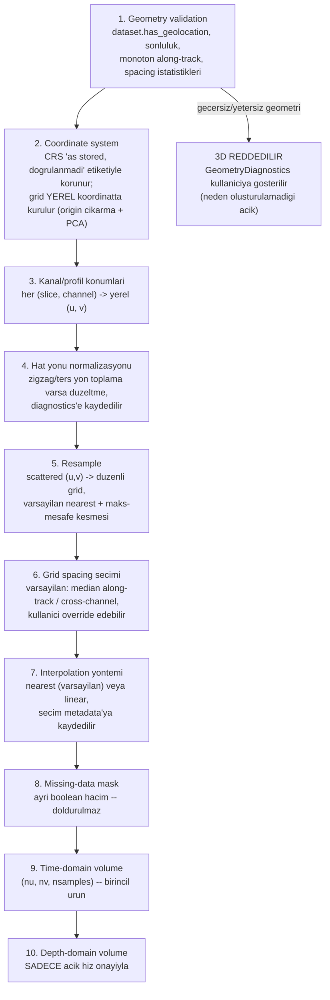

# 3D Volume Data Model (tasarım — gridding/volume henüz implemente edilmedi)

> **Durum:** Tasarım belgesi. `src/archaeogpr/gridding/` henüz yoktur.
> Bu not, gelecekteki Sprint 3D-1/3D-2'nin üzerine inşa edeceği veri
> modelini ve aşama ayrımını tanımlar — bkz.
> [[02_SPRINTS/Sprint_GUI_0_Foundation]].
>
> **Güncelleme (2026-07-19, Sprint 3D-0 sonrası):** Aşağıdaki "Aşama 1:
> Geometry validation"ın (ve kısmen Aşama 2: Coordinate system'in) kapsadığı
> alan artık gerçek runtime koduyla mevcut — ama planlanan
> `src/archaeogpr/gridding/` paketinin bir parçası olarak DEĞİL, ayrı,
> bağımsız bir Qt-free paket olarak: `src/archaeogpr/geometry/{models,
> resolve,validation,export,summary}.py`. `resolve_survey_geometry()`
> aşağıdaki `compute_trace_spacing()`'i (Aşama 1'de zaten planlanan
> yeniden-kullanım) çağırıyor, index/local-metric/global-projected
> koordinat seviyelerini çözüyor, ve her alanın provenance'ını
> (`FILE_METADATA`/`DERIVED`/`USER_SUPPLIED`/`INDEX_SPACE`/`MISSING`) ayrı
> ayrı kaydediyor. **Önemli fark:** aşağıdaki `GeometryDiagnostics` taslağı
> tek bir `can_build_volume: bool` + `rejection_reason: str | None`
> öngörüyordu; Sprint 3D-0 bunun yerine **beş ayrı, yapılandırılmış
> readiness gate'i** üretti (`index_view_ready`, `local_cscan_ready`,
> `global_cscan_ready`, `time_volume_ready`, `depth_volume_ready` — her
> biri kendi `ready`/`blocking_issues`/`warnings` üçlüsüyle), çünkü farklı
> downstream tüketicilerin (index-only görünüm, yerel C-scan, global
> C-scan, zaman-hacmi, derinlik-hacmi) gereksinimleri birbirinden farklı.
> **Bir sonraki gridding/3D sprinti, aşağıdaki `GeometryDiagnostics`
> taslağını sıfırdan implemente ETMEMELİ** — bunun yerine
> `archaeogpr.geometry.resolve_survey_geometry()`'nin ürettiği
> `GeometryResolution`/`ReadinessGates`'i girdi olarak kullanmalı. Aşama
> 3-10 (kanal/profil konumlarından resample'a, missing-mask'e, time/depth
> hacmine kadar) **hâlâ yalnızca tasarımdır** — hiçbiri implemente
> edilmedi; bu sprint kasıtlı olarak hacim/gridding üretmedi. Detay:
> [[02_SPRINTS/Sprint_3D_0_Survey_Geometry_Inspector]],
> [[06_DECISIONS/ADR_016_Geometry_Provenance_and_Readiness_Gates]].
>
> **Güncelleme (2026-07-19, commit-öncesi audit):** Gelecekteki bir
> gridding sprinti için iki kritik sözleşme netleştirildi. **(1) Gerçek
> grid ile idealize edilmiş rectilinear grid farklıdır**: `SurveyGeometry.
> x_coordinates`/`y_coordinates` (gerçek per-(trace,channel) koordinatlar,
> mevcutsa `FILE_METADATA`) ile `along_track_coordinates`/`cross_track_
> offsets`'ten kurulan idealize edilmiş rectilinear grid (`DERIVED`) ASLA
> birbirinin yerine geçmez — bir sonraki sprint, "gridding" için hangisini
> kullandığını açıkça seçmeli. `archaeogpr.geometry.regularity.assess_
> grid_regularity()` ikisi arasındaki uyumu ölçüyor (bkz. ADR-016
> Addendum) — tek bir global azimuth/spacing'in gerçek, GPS-tetiklemeli
> bir hattı tam temsil ETMEDİĞİ ampirik olarak doğrulandı (gerçek dosyada
> nokta-bazlı residual 38 cm'ye çıkıyor, şekil istatistikleri mükemmel
> olmasına rağmen) — bir sonraki sprint bu bulguyu görmezden gelip
> idealize gridi "gerçek konum" olarak kullanmamalı. **(2) C-scan grid
> sözleşmesi**: `x_coordinates`/`y_coordinates` şekli `dataset.amplitudes`in
> ilk iki ekseniyle birebir aynıdır (`(trace_count, channel_count)`,
> C-order) — `amplitudes.reshape(trace_count*channel_count, samples_count)`
> ile aynı flatten sırasını kullanan bir gridding kodu, `x_coordinates.
> flatten(order="C")` ile aynı flat-index eşlemesini güvenle varsayabilir
> (testle doğrulandı: `test_c_order_flatten_mapping_matches_trace_channel_
> indices`). **(3) CRS hâlâ doğrulanmadı** (ISSUE-001 açık) — bir sonraki
> sprint global koordinatları gerçek dünya konumlarıyla ilişkilendirmeden
> önce bunu ele almalı veya en azından `SurveyGeometry.crs_validation_
> status`'un asla `VALIDATED` olmadığını kontrol etmeli.

> **Güncelleme 2 (2026-07-19, commit-öncesi audit turu 2 — regularity
> model inceliği):** Yukarıdaki (1) numaralı maddede bahsedilen "gerçek
> grid ile idealize rectilinear grid arasındaki uyum" artık tek bir
> `is_regular` boolean'ı DEĞİL, birbirinden bağımsız dört ayrı alan
> (`GridRegularity.sampling_regular`, `direction_consistent`,
> `rectilinear_fit_acceptable`, `actual_point_grid_available`) olarak
> modelleniyor — "düzenli örneklenmiş" (adım uzunlukları/kanal aralığı
> sabit) ile "tek-origin/tek-azimuth rectilinear yeniden inşaya uyuyor"
> AYNI ŞEY DEĞİL: gerçek dosyada örnekleme mükemmel (adım uzunluğu
> CV=%2.34, kanal aralığı CV=%0.008, yön std=1.74°) olduğu halde
> rectilinear fit residual'ı 38.17 cm'ye (~5.09× kanal aralığı) çıkıyor.
> Ayrıntı için bkz. ADR-016 Addendum 2. Bir sonraki gridding sprinti bu
> ayrımı KORUMALI — "örnekleme düzenli" sonucunu "rectilinear gridleme
> güvenli" anlamına gelecek şekilde yorumlamamalı.
>
> Buna bağlı olarak **readiness gate'leri 5'ten 7'ye çıktı**:
> `local_cscan_ready` → `local_parameter_grid_ready` olarak yeniden
> adlandırıldı (yalnızca türetilmiş s/c parametre-gridi hakkında);
> yeni `rectilinear_cscan_ready` (türetilmiş grid VE gerçek grid varsa
> rectilinear fit + sampling regularity birlikte sağlanmalı) ve yeni
> `actual_xy_point_grid_ready` (yalnızca gerçek X/Y noktalarının var
> olup olmadığına bakar, rectilinearity'den bağımsız) eklendi;
> `global_cscan_ready` artık yalnızca `actual_xy_point_grid_ready` +
> CRS bilgisinden türetiliyor (asla bir rectilinearity iddiası
> içermiyor); `time_volume_ready` artık `rectilinear_cscan_ready`'ye
> bağlı. **Bir sonraki gridding/volume sprinti bu 7 gate'i olduğu gibi
> tüketmeli, kendi ad-hoc regularity kontrolünü icat etmemeli** —
> özellikle "rectilinear C-scan" ile "gerçek nokta-gridi C-scan"
> arasında hangi gate'in hangi yolu temsil ettiğini karıştırmamalı.
>
> Son olarak, tek bir `footprint_area_m2` alanı **üç ayrı, açıkça
> adlandırılmış alana** ayrıldı: `rectilinear_parameter_grid_area_m2`
> (yalnızca rectilinear fit kabul edilebilirse raporlanır),
> `approximate_ribbon_area_m2` (gerçek path uzunluğu × nominal genişlik,
> her zaman yaklaşık olduğu uyarısıyla) ve `actual_polygon_area_m2`
> (shoelace formülüyle gerçek grid sınırından, ribbon tahminiyle 3
> kat'tan fazla uyuşmazlık varsa raporlanmaz). Bir sonraki sprint hangi
> alanı hangi amaçla kullanacağını (ör. rapor, görselleştirme, dışa
> aktarım) açıkça seçmeli — üçünü birbirinin yerine kullanmamalı.

> **Güncelleme (2026-07-20, Sprint 3D-1 sonrası):** İlk gerçek amplitude
> C-scan/time-slice viewer'ı implemente edildi — ama aşağıdaki aşama
> 3-10'un (resample, missing-mask, time/depth volume) **hiçbiri değil**;
> ayrı, bağımsız bir Qt-free paket olarak:
> `src/archaeogpr/cscan/{models,compute,validation,export}.py`. Bu not
> daha önce "Test Stratejisi (Sprint 3D-1'de uygulanacak)" başlığı altında
> bir sonraki 3D-1'in doğrudan gridding/volume testleri yazacağını
> varsaymıştı — kullanıcının fiilen sipariş ettiği Sprint 3D-1 daha dar
> kapsamlıydı (bkz.
> [[02_SPRINTS/Sprint_3D_1_Actual_XY_Point_Grid_CScan]]): bir zaman
> örneği/penceresinden `(trace_count, channel_count)` bir değer gridi
> hesaplamak ve bunu gerçek X/Y point grid'inde veya idealize s/c
> parametre grid'inde render etmek — **hiçbir spatial interpolation/
> resampling/gridding yapmadan**. Aşağıdaki "Test Stratejisi" bölümünün
> sentetik 3D fixture'ları hâlâ bir sonraki gerçek gridding/volume sprinti
> için geçerli bir plan; Sprint 3D-1 onları kullanmadı, çünkü resample
> aşamasına hiç girmedi. `compute_cscan()`, `archaeogpr.geometry`'nin
> aksine `compute_trace_spacing()` gibi mevcut bir fonksiyonu yeniden
> kullanmıyor — bu proje için genuinely yeni matematik (zaman örneği/
> penceresi seçip amplitude agregasyonu). Bir sonraki gridding/volume
> sprinti hem `archaeogpr.geometry`'nin `GeometryResolution`/
> `ReadinessGates`'ini HEM DE muhtemelen `archaeogpr.cscan`'ın time-window
> seçim/aggregation mantığını (kendi zaman ekseni penceresini kopyalamak
> yerine) girdi olarak tüketmeyi değerlendirmeli. Detay:
> [[06_DECISIONS/ADR_017_Actual_XY_CScan_and_No_Interpolation_Policy]].

## Amaç

Tek bir `.ogpr` swath'ının `(slice, channel, sample)` verisinden,
**gerçek survey geometrisinden türetilen** bir quasi-3D zaman-domeni
(ve, açık bir hız onayıyla, derinlik-domeni) hacim üretmenin aşamalarını
ve veri modelini tanımlamak. GPRPy'nin `makeDataCube` fonksiyonundan
(bkz. [[09_REFERENCES/GPRPy_Reference_and_License_Notes]]) yalnızca
"nearest-neighbor + maliyet gerekçeli varsayılan" fikri alınmıştır; kod
alınmamıştır ve GPRPy'nin maskesiz (boşlukları en yakın değerle dolduran)
yaklaşımı **kasıtlı olarak** benimsenmemiştir — bu tasarım her zaman
açık bir `missing_mask` taşır.

**İlk 3D hedefi** (kullanıcı onayı): `Swath003_Array02.ogpr`'ın kendi
slice×channel geometrisinden oluşan quasi-3D hacim. Çok-swath birleştirme
sonraki sprintlere bırakıldı.

## Aşamalar (her biri ayrı, test edilebilir bir fonksiyon olacak)

## `GeometryDiagnostics` (aşama 1 çıktısı)

Mevcut `compute_trace_spacing()`
(`src/archaeogpr/processing/background.py`) zaten geolocation → metadata
`sampling_step_m` → `unavailable` önceliğini uyguluyor ve trace-spacing'i
hiçbir zaman sabit gömmüyor (bkz. ADR-008) — gridding bu fonksiyonu
**yeniden kullanacak**, kopyalamayacak. `GeometryDiagnostics` bunun
üzerine şunları ekler: `has_geolocation`, `finite_coordinate_fraction`,
`along_track_monotonic_per_channel`, `spacing_cv_per_channel`,
`direction_reversals_detected`, ve nihai `can_build_volume: bool` +
`rejection_reason: str | None`. **Uydurma hacim asla üretilmez** —
`can_build_volume=False` ise GUI kullanıcıya bu diagnostics'i (neden
reddedildiğini) gösterir, boş/varsayılan bir hacim göstermez.

## Grid ve Bellek

Örnek veri (`Swath003_Array02.ogpr`) için mevcut geometri:
along-track spacing (median) ≈ 0.0403 m, cross-channel spacing (median)
≈ 0.0750 m, profil ≈ 6.97 m, swath genişliği ≈ 0.75 m, 1024 örnek/iz
(float32) — bkz. [[04_DATASETS/Swath003_Array02]]. Varsayılan grid
spacing'iyle (du≈0.040 m, dv≈0.075 m) tahmini hacim boyutu
`nu≈175 × nv≈11 × 1024 × 4 byte` ≈ 7.9 MB — mevcut ham veriyle aynı
mertebede. Cross-track'i örn. 1 cm'e sıklaştırmak (`nv≈75`) hacmi
≈54 MB'a çıkarır — hâlâ rahat. **Bellek tahmini, hacim oluşturulmadan
önce GUI'de gösterilecek** (kullanıcı gereksinimi H) ve eşik üstünde
downsampling/grid kabalaştırma seçenekleri sunulacak.

## Zaman-Derinlik Dönüşümü

Depth-domain hacim (aşama 10), yalnızca kullanıcı bir propagation
velocity onayladığında üretilir — metadata'daki
`radar.propagation_velocity_m_per_ns` (`Swath003_Array02.ogpr` için
0.1 m/ns) **öneri olarak gösterilir**, sessizce uygulanmaz (bkz.
[[01_PROJECT_STATE/04_Risks_and_Limitations]] madde 2,
[[05_PROCESSING/Velocity_Analysis]]). Kullanılan hız, formül
(`depth = v·t/2`), birimler ve varsayımlar hacmin kendi metadata'sına
JSON olarak yazılır — CLAUDE.md'nin "Depth conversion requires an
explicit propagation velocity" kuralının 3D karşılığı.

## Interpolasyon ve Maskeleme

Varsayılan yöntem **nearest + maksimum-mesafe kesmesi** (maliyet
gerekçesiyle, GPRPy'nin `makeDataCube(method='nearest')` seçiminden
alınan fikir — bkz. referans notu); opsiyonel `linear`. GPRPy'nin aksine
kesme mesafesi dışındaki hücreler **doldurulmaz** — ayrı bir
`missing_mask` boolean hacminde taşınır, render'da şeffaf gösterilir,
export'ta korunur. İnterpolasyon yöntemi ve kesme mesafesi hacim
metadata'sına kaydedilir.

## Test Stratejisi (Sprint 3D-1'de uygulanacak)

Sentetik 3D survey fixture'ları: (a) düzgün, monoton geometri (bilinen
voxel değerleriyle doğrulama), (b) NaN koordinat içeren geometri,
(c) düzensiz hat aralığı, (d) geolocation'sız veri (3D'nin doğru şekilde
reddedildiğini ve `GeometryDiagnostics.rejection_reason`'ın doğru
raporlandığını doğrulamak için). Bkz.
[[02_SPRINTS/Sprint_GUI_0_Foundation]] Next Sprint Recommendation.

## İlgili Notlar

- [[GUI_Architecture]]
- [[Processing_Preview_and_Commit_Model]]
- [[05_PROCESSING/Depth_Slices]]
- [[05_PROCESSING/Velocity_Analysis]]
- [[04_DATASETS/Swath003_Array02]]
- [[09_REFERENCES/GPRPy_Reference_and_License_Notes]]
- [[06_DECISIONS/ADR_011_GUI_Technology_Decision]]
- [[01_PROJECT_STATE/06_GUI_3D_Risk_Register]]
- [[02_SPRINTS/Sprint_3D_0_Survey_Geometry_Inspector]]
- [[06_DECISIONS/ADR_016_Geometry_Provenance_and_Readiness_Gates]]
- [[02_SPRINTS/Sprint_3D_1_Actual_XY_Point_Grid_CScan]]
- [[06_DECISIONS/ADR_017_Actual_XY_CScan_and_No_Interpolation_Policy]]
