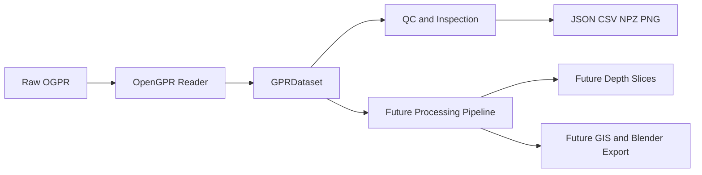

# Architecture Overview

## Amaç

Bu not, `archaeogpr` projesinin Sprint 1 sonundaki mimarisini üst seviyede özetler: ham `.ogpr` dosyasından QC (kalite kontrol) çıktılarına kadar olan veri akışını gösterir ve henüz **implemente edilmemiş** bileşenleri açıkça işaretler. Kod ve testler her zaman gerçek referans kaynağıdır; bu not sadece o gerçekliğin bir haritasıdır.

## Veri Akışı Diyagramı

## Düğüm Açıklamaları

- **A — Raw OGPR**: Diskteki ham `.ogpr` dosyası (örn. `Swath003_Array02.ogpr`). Her zaman salt okunur açılır; proje hiçbir zaman kaynak dosyayı değiştirmez veya üzerine yazmaz.
- **B — OpenGPR Reader**: `src/archaeogpr/io/ogpr_reader.py` içindeki `read_ogpr()` / `read_ogpr_header()` fonksiyonları. Metin ön ekini (preamble), JSON header'ı ve ikili veri bloklarını header'ın kendi tanımlayıcılarına (descriptor) göre okur; hiçbir byte offset'i koddan sabitlenmiş (hardcoded) değildir.
- **C — GPRDataset**: `src/archaeogpr/model/dataset.py` içindeki değişmez (immutable) `GPRDataset` frozen dataclass'ı. Okunan tüm veriler bu tek nesnede toplanır ve bir kez oluşturulduktan sonra hiçbir dizi yerinde değiştirilemez.
- **D — QC and Inspection**: `src/archaeogpr/qc/` altındaki `metadata.py`, `bscan.py`, `geometry.py` modülleri. `GPRDataset`'ten türetilmiş metrikler (zaman penceresi, derinlik tahmini, geometri istatistikleri, amplitüd istatistikleri) ve QC grafikleri (B-scan, tüm kanallar, survey geometrisi) üretir.
- **E — Future Processing Pipeline**: Sprint 1'de implemente edilmemişti; Sprint 2-4A itibarıyla zaman-sıfırı düzeltmesi, DC ofset, dewow, band-pass ve **arka plan çıkarma** gerçek kodla implemente edildi (arka plan çıkarma 8 aday olarak, hiçbiri canonical değil — bkz. [[06_DECISIONS/ADR_008_Background_Removal_Channelwise_and_Window_Policy]]). Kazanç (gain), F-K filtreleme, migrasyon gibi kalan adımlar hâlâ planlanan, henüz kodu yazılmamış katmandır. Bkz. [[Processing_Pipeline_Architecture]] ve [[Processing_Index]].
- **F — JSON CSV NPZ PNG**: `src/archaeogpr/export/basic.py` ve `qc/` modüllerinin ürettiği gerçek, çalışan çıktılar (metadata JSON, header JSON, geolocation CSV, B-scan/geometry PNG'leri, radar_volume.npz). Bkz. [[Output_and_Export_Architecture]].
- **G — Future Depth Slices**: **Sprint 1'de implemente edilmemiştir.** Zaman-domenindeki hacmi bir hız modeliyle derinlik-kayıtlı yatay dilimlere çevirecek gelecekteki modül. Bkz. [[Depth_Slices]].
- **H — Future GIS and Blender Export**: **Sprint 1'de implemente edilmemiştir.** Arkeolojik görselleştirme için planlanan GIS katmanı ve Blender dışa aktarım hattı; bu sprintte hiçbir kod, placeholder veya sahte-çalışan (fake-working) implementasyon yoktur.

## Sprint 1 Kapsamının Netliği

Diyagramdaki **A, B, C, D, F** düğümleri gerçekten çalışan, test edilmiş kod karşılığına sahiptir. **E, G, H** düğümleri ise tamamen plandır; bu düğümlerin altında hiçbir fonksiyon, sınıf veya CLI komutu mevcut değildir. Bu ayrım, projenin "implemente edilmemiş bir özelliği tamamlanmış gibi göstermeme" kuralının mimari seviyedeki karşılığıdır.

## İlgili Notlar

- [[Data_Model]] — `GPRDataset`'in alan bazında tam tanımı.
- [[OpenGPR_File_Structure]] — `.ogpr` ikili/JSON dosya formatının tam dökümü.
- [[Processing_Pipeline_Architecture]] — planlanan (henüz yazılmamış) işleme hattının sözleşmesi.
- [[Output_and_Export_Architecture]] — QC çıktıları ve export fonksiyonlarının mimarisi.
- [[Repository_Map]] — depo dizin yapısının tam listesi.
- [[ADR_001_OpenGPR_Internal_Data_Model]] — `GPRDataset` tasarımının gerekçelendirildiği mimari karar kaydı.
