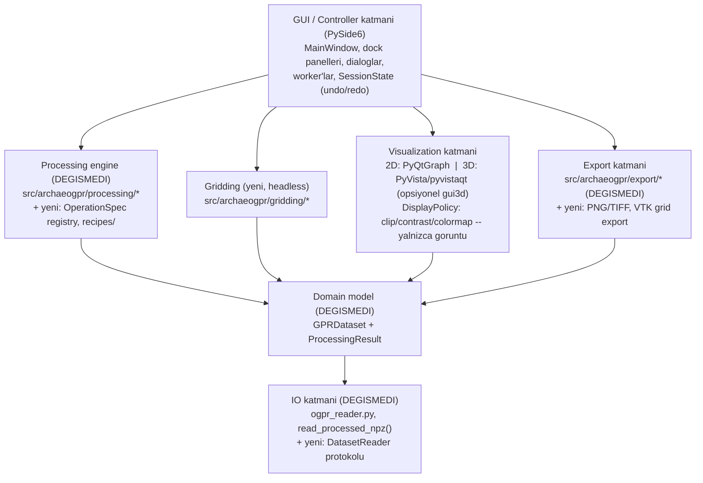
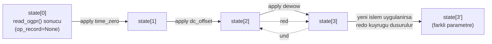

# GUI Architecture (tasarım — henüz implemente edilmedi)

> **Durum:** Bu not bir **tasarım** belgesidir, yazıldığı tarihte (Sprint
> GUI-0, 2026-07-17) `src/archaeogpr/gui/` altında hiçbir runtime kod
> yoktu. **Güncelleme (2026-07-18, Sprint GUI-1B sonrası):** GUI/Controller
> katmanının bir kısmı artık gerçek runtime koduyla mevcut —
> `src/archaeogpr/gui/{app.py,main_window.py,views/,models/,workers/}` —
> ve "Dosya okuma ... `QThread`/`QRunnable` worker'larında çalışır" satırı
> aşağıda artık gerçek: bkz.
> [[02_SPRINTS/Sprint_GUI_1B_Background_Tasks]],
> [[06_DECISIONS/ADR_014_GUI_Background_Worker_and_Cancellation_Policy]].
> **Güncelleme (2026-07-19, Sprint GUI-3A sonrası):** "Processing engine"
> katmanına GUI'den erişim de artık gerçek — `src/archaeogpr/gui/
> processing/{models,registry,adapters}.py` (registry + adapter, Qt import
> yok) ve `gui/workers/processing_worker.py`, 5 stabil processing
> fonksiyonunu (time-zero/DC offset/dewow/band-pass/background removal)
> non-destructive preview→apply akışıyla bağlıyor — bkz.
> [[02_SPRINTS/Sprint_GUI_3A_Processing_Preview_Apply]],
> [[06_DECISIONS/ADR_015_GUI_Processing_Preview_and_Atomic_Apply]].
> Recipes/gridding/3D/undo-redo katmanları aşağıda anlatıldığı gibi hâlâ
> yalnızca **tasarımdır** — henüz implemente edilmedi (processing
> registry'nin OperationSpec kısmı GUI-3A'da gerçekleşti, ama undo/redo
> stack ve recipe sistemi HENÜZ YOK — bkz. ADR-015 Alternatives
> Considered). Bu notun geri kalanı, hangi kısmın gerçek/hangisinin hâlâ
> plan olduğunu ayırt etmek için değiştirilmeden bırakıldı; kesin güncel
> durum için ilgili sprint notlarına bakın.

## Amaç

`archaeogpr`'ı, mevcut `io/model/processing/qc/export` katmanlarını **hiç
değiştirmeden** çevreleyen modern bir PySide6 masaüstü uygulamasına
dönüştürmenin katman mimarisini tanımlamak. Teknoloji kararı için bkz.
[[06_DECISIONS/ADR_011_GUI_Technology_Decision]]. GPRPy'den yalnızca
mimari/UX fikir düzeyinde referans alınmıştır, kod alınmamıştır — bkz.
[[09_REFERENCES/GPRPy_Reference_and_License_Notes]].

## Katman Diyagramı

## Katman Sözleşmeleri

- **GUI/Controller katmanı**: hiçbir sayısal işlem içermez. Her şeyi
  registry üzerinden headless `processing`/`gridding` API'lerine delege
  eder. Dosya okuma ve ağır işlemler `QThread`/`QRunnable` worker'larında
  çalışır; GUI güncellemeleri Qt sinyalleriyle yalnızca ana thread'de
  yapılır (bkz. [[Processing_Pipeline_Architecture]]'daki mevcut
  headless/test edilebilirlik ilkesinin GUI'ye taşınmış hali).
- **Visualization katmanı**: `DisplayPolicy` (colormap, yüzdelik clip,
  manuel min/max, simetrik sıfır-merkez, polarity inversion) yalnızca
  render seviyesinde bir LUT/level olarak uygulanır — `GPRDataset.
  amplitudes` asla değişmez (aynı ilke:
  [[06_DECISIONS/ADR_001_OpenGPR_Internal_Data_Model]]'in immutability garantisi, görüntü
  katmanına da taşınır). Time ve depth eksenleri ayrı nesnelerdir; depth
  yalnızca kullanıcı açıkça bir hız onayladığında etkinleşir (bkz.
  [[05_PROCESSING/Velocity_Analysis]],
  [[01_PROJECT_STATE/04_Risks_and_Limitations]] madde 2). 3D alt-modülü (`gui3d`) **lazy
  import** edilir — kurulu değilse 2D kullanım hiç etkilenmez (bkz.
  [[06_DECISIONS/ADR_011_GUI_Technology_Decision]] Consequences).
- **Processing engine**: `src/archaeogpr/processing/{time_zero,
  dc_offset,dewow,bandpass,background}.py` **hiç değişmez**. Yeni bir
  `registry.py`, her fonksiyon için bildirimsel bir `OperationSpec`
  (ad, hedef fonksiyon, parametre adı/tip/birim/geçerli aralık/varsayılan,
  `valid_mask` gereksinimi, tekrar-uygulama politikası) tanımlar; GUI
  dialogları ve gelecekteki `recipes/` modülü bu tek kaynaktan üretilir.
  Detay: [[Processing_Preview_and_Commit_Model]].
- **Gridding**: yeni, GUI'den bağımsız, headless test edilebilir bir
  paket (`src/archaeogpr/gridding/`) — geometry validation → yerel
  koordinat → resample → maskeli hacim. Detay: [[3D_Volume_Data_Model]].
- **Domain model / IO / Export**: `model/dataset.py`, `io/ogpr_reader.py`,
  `export/*.py` **hiç değişmez**. Yeni ihtiyaçlar (PNG/TIFF görüntü
  export'u, 3D grid → VTK export'u, extensible `DatasetReader` protokolü)
  bu modüllerin yanına eklenir, üzerlerine yazılmaz.

## Undo/Redo ve Oturum Durumu (özet)

`SessionState`, `GPRDataset` snapshot'larından oluşan append-only bir
liste + hareket eden bir `cursor`'dır — `GPRDataset` zaten immutable
olduğu için (bkz. ADR-001) snapshot'lar referans paylaşabilir, GPRPy'nin
`self.previous` tek-seviye/aliasing sorununun (bkz.
[[09_REFERENCES/GPRPy_Reference_and_License_Notes]] "Weaknesses") aksine
çok seviyeli, güvenli undo/redo mümkündür. Tam tasarım:
[[Processing_Preview_and_Commit_Model]].

## Bu Notta Anlatılmayanlar (kasıtlı olarak dışarıda bırakıldı)

- Kesin widget/dock isimleri, dialog yerleşimleri, buton sırası — bunlar
  GUI-1/GUI-2 implementasyon sırasında netleşecek (o sprintin kendi
  `Implementation Notes` bölümüne yazılacak).
- Picking, velocity analysis, migration, topografik düzeltme, CMP/WARR
  modu — bunlar `ADVANCED` sprint kapsamındadır, bu tasarımın parçası
  değildir (bkz. [[01_PROJECT_STATE/02_Next_Development_Sprint]]).

## İlgili Notlar

- [[06_DECISIONS/ADR_011_GUI_Technology_Decision]]
- [[3D_Volume_Data_Model]]
- [[Processing_Preview_and_Commit_Model]]
- [[Architecture_Overview]]
- [[Data_Model]]
- [[Processing_Pipeline_Architecture]]
- [[09_REFERENCES/GPRPy_Reference_and_License_Notes]]
- [[01_PROJECT_STATE/06_GUI_3D_Risk_Register]]
- [[02_SPRINTS/Sprint_GUI_0_Foundation]]
- [[02_SPRINTS/Sprint_GUI_1_Viewer_Shell]]
- [[02_SPRINTS/Sprint_GUI_2_Display_Controls]]
- [[02_SPRINTS/Sprint_GUI_1B_Background_Tasks]]
- [[06_DECISIONS/ADR_014_GUI_Background_Worker_and_Cancellation_Policy]]
- [[02_SPRINTS/Sprint_GUI_3A_Processing_Preview_Apply]]
- [[06_DECISIONS/ADR_015_GUI_Processing_Preview_and_Atomic_Apply]]
