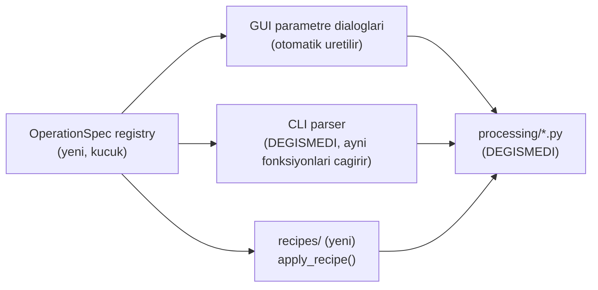
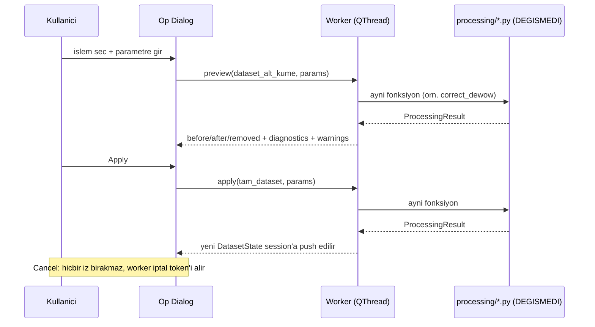

# Processing Preview and Commit Model (kısmen implemente edildi — bkz. güncelleme)

> **Durum (2026-07-17, Sprint GUI-0):** Tasarım belgesi. `registry.py`,
> `recipes/` ve GUI dialogları henüz yoktur. Bu not, GUI'nin mevcut
> `processing/` fonksiyonlarını (değiştirmeden) nasıl çağıracağını ve
> undo/redo + preview/apply akışının nasıl çalışacağını tanımlar — bkz.
> [[02_SPRINTS/Sprint_GUI_0_Foundation]].
>
> **Güncelleme (2026-07-19, Sprint GUI-3A sonrası):** Bu belgenin
> **registry + preview/apply** bölümü artık gerçek runtime koduyla
> mevcut — `src/archaeogpr/gui/processing/{models,registry,adapters}.py`,
> `src/archaeogpr/gui/workers/processing_worker.py`,
> `DatasetSession`'ın raw/current/preview ayrımı. Aşağıdaki "Operation
> Registry" ve "Preview / Apply / Cancel Akışı" bölümleri artık büyük
> ölçüde gerçek — gerçek implementasyon detayları için
> [[06_DECISIONS/ADR_015_GUI_Processing_Preview_and_Atomic_Apply]] ve
> [[02_SPRINTS/Sprint_GUI_3A_Processing_Preview_Apply]]'a bakın. **Aşağıdaki
> "Dataset State ve Undo/Redo" (append-only `SessionState`/`DatasetState`
> + `cursor`) ve "Recipe" bölümleri hâlâ yalnızca tasarımdır — GUI-3A
> bunları implemente ETMEDİ** (kasıtlı kapsam kararı, bkz. ADR-015
> Alternatives Considered): GUI-3A yalnızca `raw_dataset`/`current_dataset`/
> `preview_dataset` + tek bir `current_revision` sayacı kullanıyor, adım
> adım geri alınabilir bir history listesi/cursor YOK. Bu notun geri
> kalanı, hangi kısmın gerçek/hangisinin hâlâ plan olduğunu ayırt etmek
> için değiştirilmeden bırakıldı.
>
> **Güncelleme (2026-07-19, Sprint 3D-0 sonrası):** Yeni bir
> `GeometrySession` (`src/archaeogpr/gui/models/geometry_session.py`)
> eklendi, ama bu belgedeki `DatasetSession`/raw-current-preview modelinin
> bir **parçası değil** — kasıtlı olarak ayrı, bağımsız bir oturum
> durumu. Geometri yalnızca başarılı bir dosya yüklemesinde bir kez
> resolve edilir; aşağıdaki hiçbir preview/apply/discard/reset-to-raw
> geçişi geometriyi asla yeniden çözmez veya değiştirmez (bu 5 processing
> operasyonundan hiçbiri trace/channel sayısını değiştirmediği için).
> Geometri override'ının kendi `Apply Geometry`'si yalnızca
> `GeometrySession`'ın kendi `geometry_revision`'ını artırır —
> `DatasetSession.current_revision`'a asla dokunmaz — ve `processing_
> history`'ye asla yazılmaz. Detay:
> [[02_SPRINTS/Sprint_3D_0_Survey_Geometry_Inspector]],
> [[06_DECISIONS/ADR_016_Geometry_Provenance_and_Readiness_Gates]].
>
> **Güncelleme (2026-07-20, Sprint 3D-1 sonrası):** Yeni bir
> `CScanSession` (`src/archaeogpr/gui/models/cscan_session.py`) eklendi —
> `GeometrySession` gibi bu da `DatasetSession`'a hiç referans tutmuyor,
> yalnızca geçmiş bir C-scan compute'unun kullandığı
> `source_revision`/`geometry_revision`'ın bir anlık görüntüsünü saklıyor.
> `MainWindow` bunları canlı `DatasetSession.current_revision`
> (`CURRENT` kaynağı için) / `id(preview_dataset)` (`PREVIEW` kaynağı
> için, `preview_base_revision` değil — bkz. ADR-017 Decision 7) /
> `GeometrySession.geometry_revision`'a karşı karşılaştırıp
> `CScanSession.is_stale()` ile stale sonuçları tespit ediyor. Bu
> karşılaştırma, `ProcessingWorker`'ın `base_revision`'ının
> `DatasetSession.current_revision`'a karşı zaten `MainWindow` tarafından
> (worker'ın kendisi tarafından değil) karşılaştırılmasıyla birebir aynı
> desen. C-scan compute'u, aşağıdaki preview/apply/discard/reset-to-raw
> akışının **hiçbirini değiştirmiyor** — yalnızca üç yönlü mutual
> exclusion'a yeni bir taraf olarak katılıyor (`ActiveTaskKind`, bkz.
> ADR-017 Decision 9). Detay:
> [[02_SPRINTS/Sprint_3D_1_Actual_XY_Point_Grid_CScan]],
> [[06_DECISIONS/ADR_017_Actual_XY_CScan_and_No_Interpolation_Policy]].

## Amaç

Kullanıcının 5 mevcut işlemi (`correct_time_zero`, `correct_dc_offset`,
`correct_dewow`, `correct_bandpass`, `remove_background`) GUI üzerinden
**önizleme (preview) → uygulama (apply) → geri alma (undo/redo) →
yeniden çalıştırılabilir tarif (recipe)** akışıyla kullanabilmesinin
tasarımını, `processing/*.py` içindeki tek bir satırı değiştirmeden
tanımlamak.

## Neden Mümkün: Mevcut Sözleşme Zaten Bu Tasarıma Hazır

- `GPRDataset` immutable (bkz.
  [[06_DECISIONS/ADR_001_OpenGPR_Internal_Data_Model]]) — her işlem yeni bir dataset
  döndürür, girdisini değiştirmez.
- `ProcessingResult` (dataset + `removed_component` + `diagnostics` +
  `warnings` + `valid_mask`) zaten before/after/removed-component
  ayrımını taşıyor.
- `dataset.processing_history`, JSON-serileştirilebilir bir tuple olarak
  her adımın `operation`/`parameters`/`diagnostics`/`warnings`'ini
  kaydediyor (`build_processing_record()`,
  `src/archaeogpr/processing/common.py`).

Bu üçü birlikte, GPRPy'nin `history` = çalıştırılabilir Python
kaynak-string listesi yaklaşımının (bkz.
[[09_REFERENCES/GPRPy_Reference_and_License_Notes]]) ihtiyaç duymadığı bir zemin sağlıyor
— bizim `processing_history`'miz zaten yapısal veri.

## Operation Registry



Her mevcut işlev için bir `OperationSpec`: ad, hedef fonksiyon referansı,
parametre listesi (`name, type, unit, valid_range, default,
description`), `valid_mask` gereksinimi, tekrar-uygulama politikası
(örn. `correct_dewow`'un `allow_repeat_processing` bayrağı). Parametre
doğrulaması **tek kaynaktan** (spec) gelir — GUI dialogu, CLI parser ve
recipe uygulayıcı aynı spec'i okur, üç ayrı yerde parametre listesi
elle tekrarlanmaz.

## Preview / Apply / Cancel Akışı



**Preview**, seçili kanal(lar) veya downsample edilmiş alt küme üzerinde
çalışır (veri küçükse — bu projede tek swath ≤ ~8 MB — tam veri
üzerinde de çalışabilir); **apply** tam veri üzerinde. **İkisi de aynı
`processing/*.py` fonksiyonunu çağırır** — preview ile apply arasında
ayrı bir matematik yolu yoktur, tek fark girdi boyutudur. Preview
sonucu `SessionState`'e **girmez**; yalnızca dialog içinde
before/after/removed-component + diagnostics + warnings gösterilir.

## Dataset State ve Undo/Redo

```
SessionState
  states: list[DatasetState]      # append-only
  cursor: int                     # aktif state indeksi
DatasetState
  dataset: GPRDataset              # immutable, referans paylasimi guvenli
  valid_mask: ndarray | None
  op_record: Mapping | None        # bu state'i ureten processing_history kaydi (state[0] icin None)
```

`state[0]`, dosyadan okunan (`read_ogpr`/`read_processed_npz`) dataset'tir
ve **hiçbir zaman** değiştirilmez. Undo = `cursor -= 1`; redo =
`cursor += 1`. Veri kopyalanmaz — yalnızca işaretçi hareket eder;
`GPRDataset` immutable olduğu için aliasing riski yoktur (GPRPy'nin tek
seviyeli, referans-kopyalı `self.previous`'ının aksine — bkz. referans
notundaki "Weaknesses" #2/#3). Cursor geçmişteyken yeni bir işlem
uygulanırsa redo kuyruğu standart şekilde atılır. Bellek politikası:
`max_states`/`max_bytes` sınırı; sınır aşımında en eski ara state'lerin
dizileri düşürülür ama `op_record`'ları (recipe'den yeniden üretilebilir
olacak şekilde) korunur.

## Recipe (Yeniden Çalıştırılabilirlik)

`dataset.processing_history` zaten her adımın parametrelerini taşıyor.
Yeni `recipes/recipe.py`: `history_to_recipe(dataset) → recipe dict`
(operation + parameters; diagnostics hariç — diagnostics bir çalıştırmanın
*sonucu*dur, tarifin *girdisi* değil) ve `apply_recipe(dataset, recipe) →
list[DatasetState]`. Kanonik format **JSON**; **YAML** yalnızca
okunabilir/elle-düzenlenebilir ikincil format olarak desteklenir (proje
zaten `pyyaml` kullanıyor — `configs/*_candidates.yaml` ile aynı
kütüphane). Round-trip doğrulaması: canonical NPZ'nin
(`outputs/sprint03/canonical_D2_B1/sprint03_processed.npz`) history'sinden
üretilen bir recipe, ham dosyaya uygulandığında amplitüd hash'i aynı NPZ
ile eşleşmeli — bu test Sprint GUI-3'te yazılacak.

GPRPy'nin `writeHistory()`'sinin (çalıştırılabilir `.py` script'i,
hard-coded `mygpr` değişken adı — bkz. referans notu) aksine, recipe
**veri**dir, kod değildir — `exec`/`eval` gerektirmez, versiyon/şema
kontrolüne açıktır.

## Raw Veri Garantisi

Bu model boyunca `data/raw/*.ogpr` hiçbir zaman yazılmaz — `state[0]`
dosyadan okunur, sonraki her `DatasetState` bellekte yeni bir
`GPRDataset`'tir. Kaydetme her zaman kullanıcının seçtiği yeni bir
NPZ/JSON'a yapılır (mevcut `export/processed.py`,
`export/sprint3.py::read_processed_npz` ile simetrik).

## İlgili Notlar

- [[GUI_Architecture]]
- [[3D_Volume_Data_Model]]
- [[06_DECISIONS/ADR_001_OpenGPR_Internal_Data_Model]]
- [[06_DECISIONS/ADR_011_GUI_Technology_Decision]]
- [[09_REFERENCES/GPRPy_Reference_and_License_Notes]]
- [[05_PROCESSING/Processing_Order]]
- [[02_SPRINTS/Sprint_GUI_0_Foundation]]
- [[02_SPRINTS/Sprint_GUI_3A_Processing_Preview_Apply]]
- [[06_DECISIONS/ADR_015_GUI_Processing_Preview_and_Atomic_Apply]]
- [[02_SPRINTS/Sprint_3D_0_Survey_Geometry_Inspector]]
- [[06_DECISIONS/ADR_016_Geometry_Provenance_and_Readiness_Gates]]
- [[02_SPRINTS/Sprint_3D_1_Actual_XY_Point_Grid_CScan]]
- [[06_DECISIONS/ADR_017_Actual_XY_CScan_and_No_Interpolation_Policy]]
