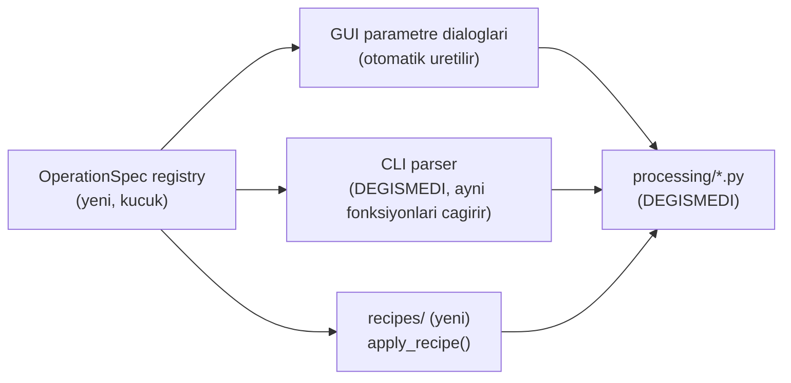
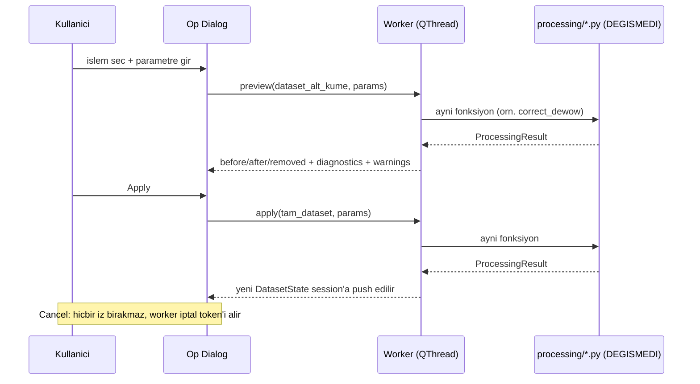

# Processing Preview and Commit Model (tasarım — henüz implemente edilmedi)

> **Durum:** Tasarım belgesi. `registry.py`, `recipes/` ve GUI dialogları
> henüz yoktur. Bu not, GUI'nin mevcut `processing/` fonksiyonlarını
> (değiştirmeden) nasıl çağıracağını ve undo/redo + preview/apply
> akışının nasıl çalışacağını tanımlar — bkz.
> [[02_SPRINTS/Sprint_GUI_0_Foundation]].

## Amaç

Kullanıcının 5 mevcut işlemi (`correct_time_zero`, `correct_dc_offset`,
`correct_dewow`, `correct_bandpass`, `remove_background`) GUI üzerinden
**önizleme (preview) → uygulama (apply) → geri alma (undo/redo) →
yeniden çalıştırılabilir tarif (recipe)** akışıyla kullanabilmesinin
tasarımını, `processing/*.py` içindeki tek bir satırı değiştirmeden
tanımlamak.

## Neden Mümkün: Mevcut Sözleşme Zaten Bu Tasarıma Hazır

- `GPRDataset` immutable (bkz.
  [[06_DECISIONS/ADR_001_OpenGPR_Internal_Data_Model]]) — her işlem yeni bir dataset
  döndürür, girdisini değiştirmez.
- `ProcessingResult` (dataset + `removed_component` + `diagnostics` +
  `warnings` + `valid_mask`) zaten before/after/removed-component
  ayrımını taşıyor.
- `dataset.processing_history`, JSON-serileştirilebilir bir tuple olarak
  her adımın `operation`/`parameters`/`diagnostics`/`warnings`'ini
  kaydediyor (`build_processing_record()`,
  `src/archaeogpr/processing/common.py`).

Bu üçü birlikte, GPRPy'nin `history` = çalıştırılabilir Python
kaynak-string listesi yaklaşımının (bkz.
[[09_REFERENCES/GPRPy_Reference_and_License_Notes]]) ihtiyaç duymadığı bir zemin sağlıyor
— bizim `processing_history`'miz zaten yapısal veri.

## Operation Registry



Her mevcut işlev için bir `OperationSpec`: ad, hedef fonksiyon referansı,
parametre listesi (`name, type, unit, valid_range, default,
description`), `valid_mask` gereksinimi, tekrar-uygulama politikası
(örn. `correct_dewow`'un `allow_repeat_processing` bayrağı). Parametre
doğrulaması **tek kaynaktan** (spec) gelir — GUI dialogu, CLI parser ve
recipe uygulayıcı aynı spec'i okur, üç ayrı yerde parametre listesi
elle tekrarlanmaz.

## Preview / Apply / Cancel Akışı



**Preview**, seçili kanal(lar) veya downsample edilmiş alt küme üzerinde
çalışır (veri küçükse — bu projede tek swath ≤ ~8 MB — tam veri
üzerinde de çalışabilir); **apply** tam veri üzerinde. **İkisi de aynı
`processing/*.py` fonksiyonunu çağırır** — preview ile apply arasında
ayrı bir matematik yolu yoktur, tek fark girdi boyutudur. Preview
sonucu `SessionState`'e **girmez**; yalnızca dialog içinde
before/after/removed-component + diagnostics + warnings gösterilir.

## Dataset State ve Undo/Redo

```
SessionState
  states: list[DatasetState]      # append-only
  cursor: int                     # aktif state indeksi
DatasetState
  dataset: GPRDataset              # immutable, referans paylasimi guvenli
  valid_mask: ndarray | None
  op_record: Mapping | None        # bu state'i ureten processing_history kaydi (state[0] icin None)
```

`state[0]`, dosyadan okunan (`read_ogpr`/`read_processed_npz`) dataset'tir
ve **hiçbir zaman** değiştirilmez. Undo = `cursor -= 1`; redo =
`cursor += 1`. Veri kopyalanmaz — yalnızca işaretçi hareket eder;
`GPRDataset` immutable olduğu için aliasing riski yoktur (GPRPy'nin tek
seviyeli, referans-kopyalı `self.previous`'ının aksine — bkz. referans
notundaki "Weaknesses" #2/#3). Cursor geçmişteyken yeni bir işlem
uygulanırsa redo kuyruğu standart şekilde atılır. Bellek politikası:
`max_states`/`max_bytes` sınırı; sınır aşımında en eski ara state'lerin
dizileri düşürülür ama `op_record`'ları (recipe'den yeniden üretilebilir
olacak şekilde) korunur.

## Recipe (Yeniden Çalıştırılabilirlik)

`dataset.processing_history` zaten her adımın parametrelerini taşıyor.
Yeni `recipes/recipe.py`: `history_to_recipe(dataset) → recipe dict`
(operation + parameters; diagnostics hariç — diagnostics bir çalıştırmanın
*sonucu*dur, tarifin *girdisi* değil) ve `apply_recipe(dataset, recipe) →
list[DatasetState]`. Kanonik format **JSON**; **YAML** yalnızca
okunabilir/elle-düzenlenebilir ikincil format olarak desteklenir (proje
zaten `pyyaml` kullanıyor — `configs/*_candidates.yaml` ile aynı
kütüphane). Round-trip doğrulaması: canonical NPZ'nin
(`outputs/sprint03/canonical_D2_B1/sprint03_processed.npz`) history'sinden
üretilen bir recipe, ham dosyaya uygulandığında amplitüd hash'i aynı NPZ
ile eşleşmeli — bu test Sprint GUI-3'te yazılacak.

GPRPy'nin `writeHistory()`'sinin (çalıştırılabilir `.py` script'i,
hard-coded `mygpr` değişken adı — bkz. referans notu) aksine, recipe
**veri**dir, kod değildir — `exec`/`eval` gerektirmez, versiyon/şema
kontrolüne açıktır.

## Raw Veri Garantisi

Bu model boyunca `data/raw/*.ogpr` hiçbir zaman yazılmaz — `state[0]`
dosyadan okunur, sonraki her `DatasetState` bellekte yeni bir
`GPRDataset`'tir. Kaydetme her zaman kullanıcının seçtiği yeni bir
NPZ/JSON'a yapılır (mevcut `export/processed.py`,
`export/sprint3.py::read_processed_npz` ile simetrik).

## İlgili Notlar

- [[GUI_Architecture]]
- [[3D_Volume_Data_Model]]
- [[06_DECISIONS/ADR_001_OpenGPR_Internal_Data_Model]]
- [[06_DECISIONS/ADR_011_GUI_Technology_Decision]]
- [[09_REFERENCES/GPRPy_Reference_and_License_Notes]]
- [[05_PROCESSING/Processing_Order]]
- [[02_SPRINTS/Sprint_GUI_0_Foundation]]
